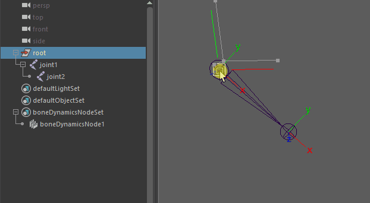
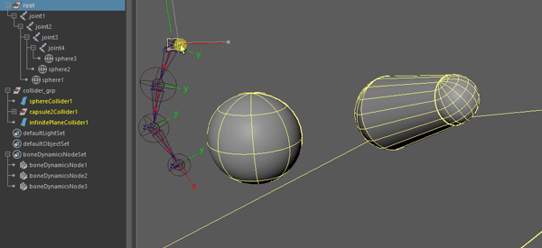
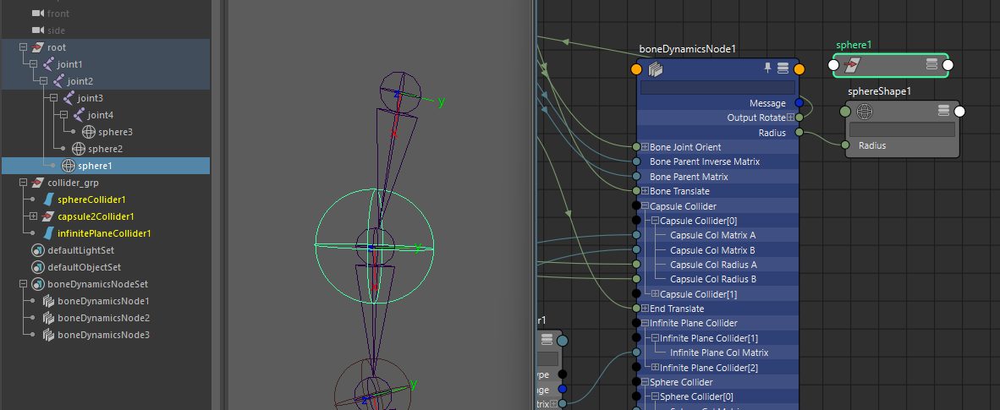
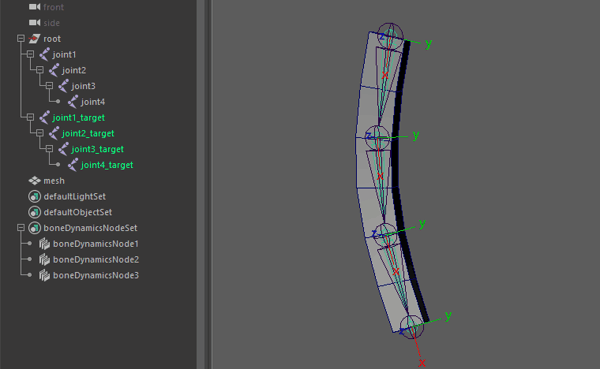
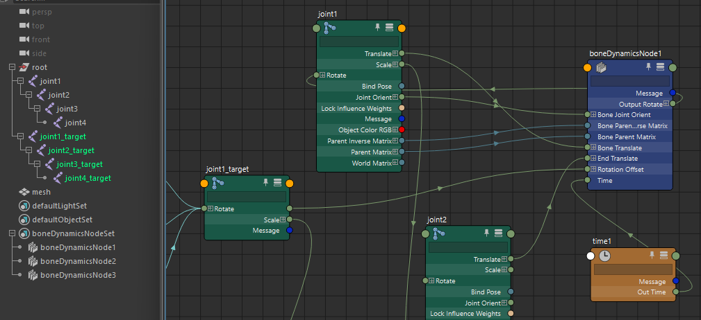
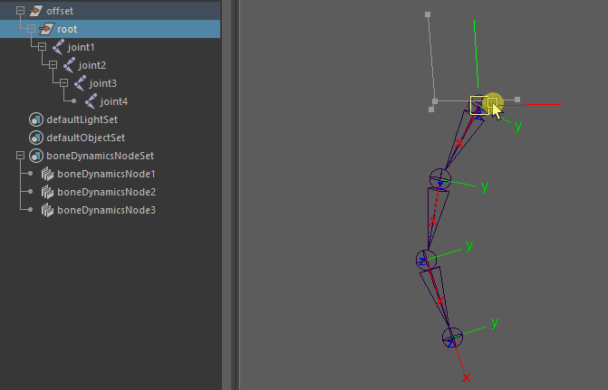
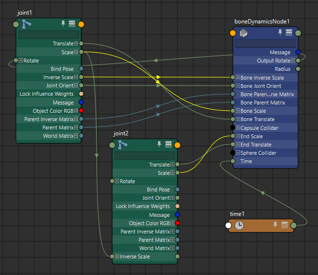
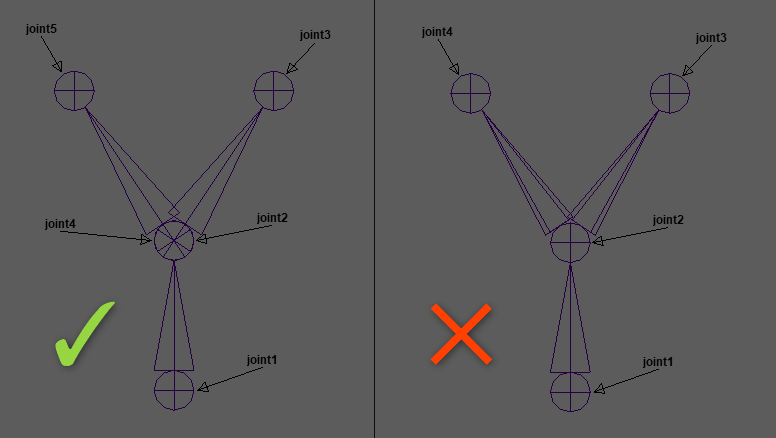

# boneDynamicsNode
   
A custom node that applies dynamics to one section of a joint chain. It can be included directly into the rig, or Bake & Purge over the rig.  

> ⚠**Warning**⚠  
> Internal Use ID `0x7b001` is used.

## Installaion  
1. Put [boneDynamicsNode.mll](#Pre-built-plug-ins) in `C:\Users\<USERNAME>\Documents\maya\<MAYAVERSION>\plug-ins`.  
2. Load "boneDynamicsNode.mll" from Plug-in Manager.  

## Basic Usage
Create any joint chain and connect the `boneDynamicsNode` per section. The minimum required connections are as follows:

### Required Connections

- `Time`  
- `Bone Translate`  
- `Bone Joint Orient`  
- `Bone Parent Matrix`  
- `Bone Parent Inverse Matrix`  
- `End Translate`  
- `Output Rotate`  

To rotate joint1, with joint2 as the tip...


Let's move the current frame to 1 or later and move the root. The joint-chain shakes!  



> 💡**Requirements for Joint**  
> Joint chain must meet the requirements [here](#Requirements-for-Joint).

> 💡**Sample Script**  
> [basic_usage.py](scripts/basic_usage.py) is a script to connect bonedynamicsNode to any joint chain. Please select and execute them in order from the root of the joint to the tip of the joint.  

### Attributes to Check
- `Enable` : Turning it off disables all calculations.  
- `Reset Time` : Dynamics are disabled when the current frame is equal to or less than this value. In other words, start frame of the simulation.  
- `Fps` : Used to calculate delta time. Enter a value equal to the FPS of the scene. Default is 30.  

### Dynamics Attributes
- `Damping` : Attenuates speed. The larger the value, the harder it is to accelerate.  
- `Elasticity` : Force to return to the original posture.  
- `Stiffness` : Suppresses changes between frames (steps). Setting to 1 will result in loss of motion.  
- `Mass` : Affects the force to return to the original posture.  
- `Gravity` : If Y-up and the unit is in centimeters, set [0,-980,0].  
- `Gravity Multiply` : Will be multiplied by Gravity.  

### Bake to Keyframes
Select the joint and execute "Bake Simulation" from the "Key" menu. Then delete the boneDynamicsNode.  

### Requirements for Joint
- Rotate should be [0,0,0], with only the Joint Orient having a value.
- Do not edit rotatePivot, rotatePivotTranslate, scalePivot, or scalePivotTranslate.  
- Rotate Oeder is only available for xyz.  
- Rotate Axis should remain [0,0,0].  
- Leave Inherits Transform checked.  
- Leave Offset Parent Matrix at its default value.  
- Receive InverseScale from the parent Scale and leave Segment Scale Compensate checked. Shear not supported.  

All of the above checkpoints can be satisfied by making joints as usual.  

## Features
### Collisions

4 types of collisions are available: ground, sphere, capsule, and infinite plane. Colliders can be created with [maya_expressionCollision](https://github.com/akasaki1211/maya_expressionCollision).  



- `Radius` : Radius of the end-joint.  
- `Iterations` : Higher values increase the accuracy of collisions. Recommended value is 3 to 5. 0 disables collisionss.  
- `Enable Ground Col` : Enable ground collision.  
- `Ground Height` : Height of the ground.  
- `Sphere Col Matrix` : Connect the sphere collider worldMatrix.  
- `Sphere Col Radius` : Radius of sphere collider.  
- `Capsule Col Matrix A` `Capsule Col Matrix B` : Connect worldMatrix on one side of the capsule collider.  
- `Capsule Col Radius A` `Capsule Col Radius B` : Connect the radius of one side of the capsule collider.  
- `Infinite Plane Col Matrix` : Connect worldMatrix of infinite plane collider.  

The attributes that connect the collider are in a list, so you can use more than one. Ground Collision do not need connections.  
 


> 💡**Visualize Radius**  
> Place a nurbsSphere or implicitSphere as a child of end-joint and connect `Radius`.  
> 

> 💡**Note**  
> Colliders do not necessarily need to use [expcol](https://github.com/akasaki1211/maya_expressionCollision). It can be anything as long as the required attributes are connected.  
>   

### Specify Target Pose

The converging pose can be manipulated by duplicating the joint-chain and connecting Rotate to `Rotation Offset`.  





### Offset Transform

You can cancel the transform by connecting the worldMatrix of the node you do not want affected (such as the root controller of character) to the `Offset Matrix`.




### Supports Scale per Section
Connecting each scale value to `Bone Scale`, `Bone Inverse Scale`, and `End Scale` enables a scale per section.  
> ⚠Please avoid non-uniform scales.  




### Branching


Branching is possible, but good results are obtained with joints like the one on the left of the image. The right one does not give good results.



> 💡**Sample Script**  
> [advanced_usage.py](scripts/advanced_usage.py) is a script to connect bonedynamicsNode to any joint chain. Please select and execute them in order from the root of the joint to the tip of the joint.  
> - Enable per-section scaling.  
> - If place the collider created by expcol as a child of 'collider_grp', to be connected.  
> - If duplicate the joint-chain to be simulated and add '_target' to the end of the name, to allow manipulation of the target posture.  
> - If a node named "offset" exists, will be connected to cancel the transform.  

## Pre-built plug-ins
Pre-built `boneDynamicsNode.mll` in the [plug-ins](./plug-ins) folder. Install to the appropriate Maya version and ready to use.  
|Build|Plug-in<br>(*Click on "Download raw file" at the link.)|
|---|---|
|Maya 2022 Update 5 win64|[Download](./plug-ins/2022/boneDynamicsNode.mll)|
|Maya 2023 Update 3 win64|[Download](./plug-ins/2023/boneDynamicsNode.mll)|
|Maya 2024 Update 2 win64|[Download](./plug-ins/2024/boneDynamicsNode.mll)|

## How to Build  
For example, Maya 2024 in Windows:  
1. Install Visual Studio 2022
2. Install CMake 3.22.1 or higher
3. Donwload SDKs from [Maya API | Autodesk Platform Services (APS)](https://aps.autodesk.com/developer/overview/maya)
4. Set `devkitBase` path in the `DEVKIT_LOCATION` environment variable.  
5. Generate a project with the following command:
```
cd src
cmake . -Bbuild_2024 -G "Visual Studio 17 2022" -A x64
```
6. Build with Visual Studio or with the following command:
```
cmake --build build_2024
```

## Known Issues
- Not compute when connected to child plug.
- Offset Matrix is not reset properly at Reset Time.
- Rotation Offset is not reflected at Reset Time.

## TODO
- [ ] Angle Limit  
- [ ] Additional Force  
- [ ] Stretchable
